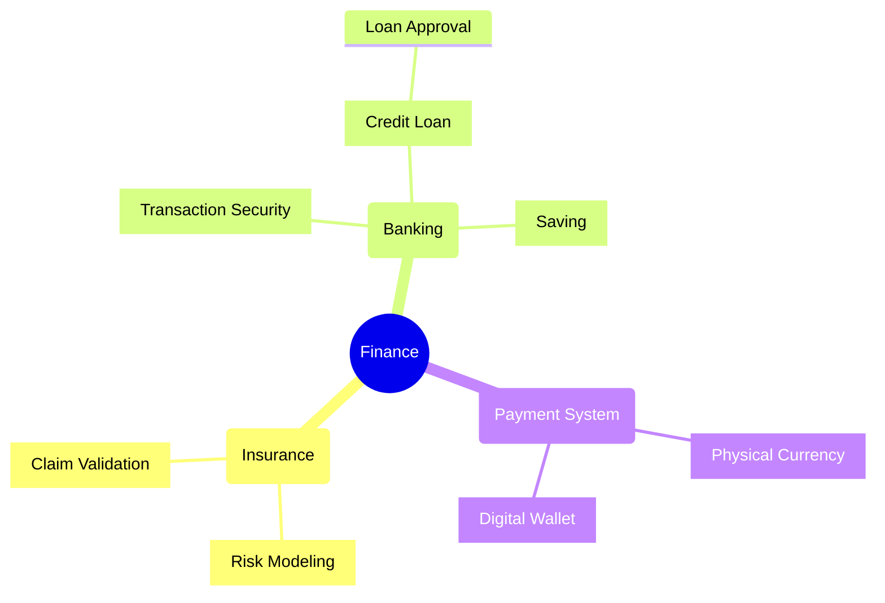
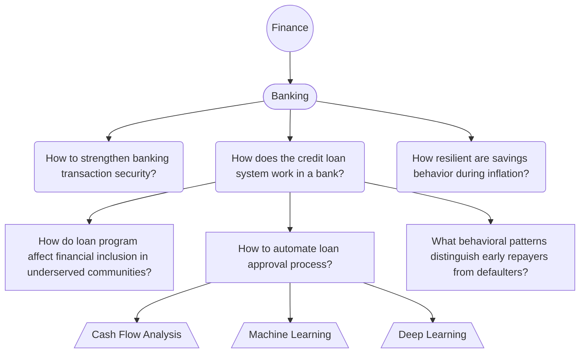
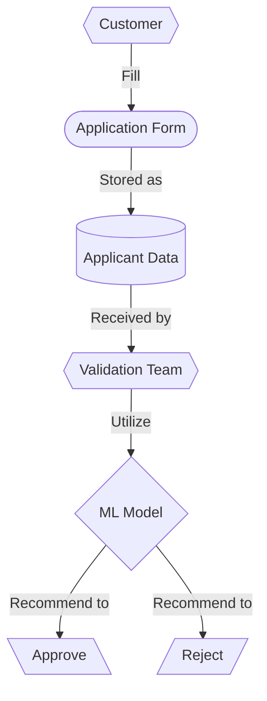

# Mind Map: Finance Topic

```mermaid
mindmap
root((Finance))
    (Insurance)
        [Risk Modeling]
        [Claim Validation]
    (Banking)
        [Transaction Security]
        [Credit Loan]
            Loan Approval
        [Saving]
    (Payment System)
        [Physical Currency]
        [Digital Wallet]
```

# Concept Map: Research Question

```mermaid
graph

%% nodes definition
BT((Finance))
FI([Banking])
GQ1(How to strengthen banking transaction security?)
GQ2(How does the credit loan system work in a bank?)
GQ3(How resilient are savings behavior during inflation?)
SQ1[How do loan program affect financial inclusion in underserved communities?]
SQ2[How to automate loan approval process?]
SQ3[What behavioral patterns distinguish early repayers from defaulters?]
M1[/Cash Flow Analysis\]
M2[/Machine Learning\]
M3[/Deep Learning\]

%% nodes use
BT --> FI
FI --> GQ1
FI --> GQ2
FI --> GQ3
GQ2 --> SQ1
GQ2 --> SQ2
GQ2 --> SQ3
SQ2 --> M1
SQ2 --> M2
SQ2 --> M3
```

# Concept Map: Proposed Loan Validation Procedure

```mermaid
graph
%% nodes definition
%% A@{shape: doc}

S1{{Customer}}
S2{{Validation Team}}

D1[\Approve\]
D2[/Reject/]

O1([Application Form])
O2[(Applicant Data)]
O3{ML Model}

%% nodes use
S1 -- Fill --> O1
O1 -- Stored as --> O2
O2 -- Received by --> S2
S2 -- Utilize --> O3
O3 -- Recommend to --> D1
O3 -- Recommend to --> D2 
```